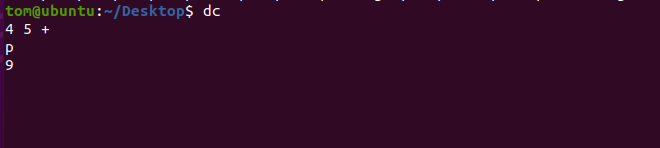
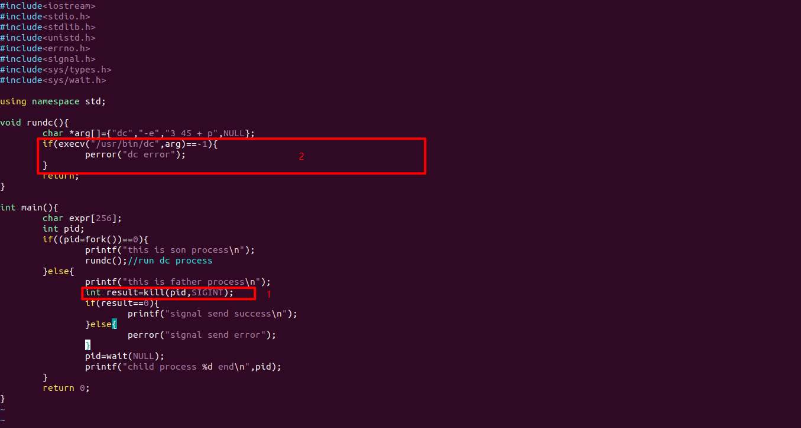

## bc程序设计思路
bc程序将我们输入的算术表达式转换成逆波兰表达式再传递给dc程序
### 参数传递
问题一个是dc程序的参数怎么传递的问题

dc程序是这种交互式的程序，所以他的参数怎么传递呢
可以使用dc的-e参数，就可以不使用交互的方式了

### 执行流程
另一个是执行流程的问题，main函数接收用户输入的算术表达式，再将其转换为逆波兰表达式，再将逆波兰表达式传递给dc进程。
使用exec函数族调用dc进程

父进程要先等子进程调用execv函数后再干掉子进程，这个顺序如何把控

一种方法可以使用信号屏蔽的方法，在执行execv函数之前屏蔽sigint信号，但是sigint信号不可以被屏蔽，所以此方法不可行

可以使用信号量，可以使用条件变量

但是这里是两个进程，而信号量和条件变量是线程之间同步的手段，因此我们需要的是进程之间同步的手段

信号量既可以用于进程间同步也可以用于线程间同步
