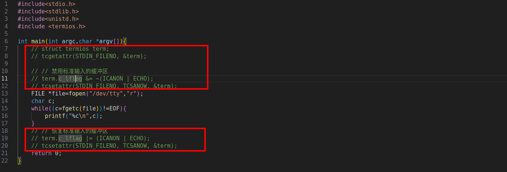

### 程序介绍
这是一个more程序，功能和linux more命令大致一样

### 基本思路
设置一个页面显示行数的数值，每次让页面刷新这么多的行数，底部需要设置一个状态条，而且状态条要维持在底部

需要使用fgets函数，将文件内容存储到缓冲区中
再将缓冲区内容输出到屏幕上
文件结束时候，程序要结束

### getchar
linux有三种缓冲模式，全缓冲，行缓冲，和无缓冲
那么getchar()是哪种缓冲模式
通过禁用标准输入的缓冲区实现按下q时候立刻终止

缓冲区问题，为什么fgetc是没有缓冲效果的，但是这里的fgetc还是不是立即输出呢，
虽然fgetc是无缓冲的，但是键盘的输入本身有一个缓冲区，因为这个键盘的缓冲，fgetc根本就没有接受到用户的输入
因此，禁用键盘的输入缓冲，才是解决方法

对于无缓冲模式的输入，不会显示在屏幕上

上述键盘的缓冲应该就是所谓的内核缓冲
内核不直接读写设备，而是通过缓冲区跟设备打交道

### 需要解决的问题
在more命令的输入源被定义成管道后，那么标准输入就是more命令的输入了，这个时候还要如何从键盘输入控制命令呢，因为已经没有办法在从标准输入接受键盘输入了，需要一种不通过标准输入读取键盘的手段

文件/dev/tty是键盘显示器文件，向这个文件写，相当于往屏幕上显示，从这个文件读，相当于从键盘读取

用户态通过系统调用进入内核态

### 缓冲
用户级的缓冲和内核级的缓冲

